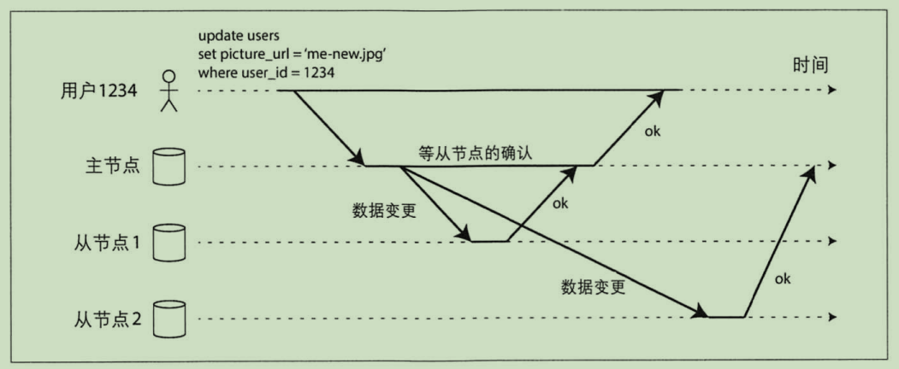

## 主节点与从节点

主从复制的原理如下：
1. 指定一个副本为主副本（主节点），当客户写数据库时，必须将写请求首先发送给主副本，主副本首先将新数据写入本地存储
2. 其它副本全部成为从副本（从节点），主副本把新数据写入本地存储后，然后将数据变更作为复制的日志或更改流发送给所有从副本。每个从副本获得更改日志之后
   将其应用到本地，并严格保持与祝福本相同的写入顺序。
3. 客户端从数据库读取数据时，可以在主副本或从副本上执行查询。但是只有主副本能够接收写请求；从客户端的角度看，从副本都是只读的。

主从复制不仅限于数据库，还广泛应用于分布式消息队列如`Kafka`和`RabbitMQ`。

## 同步复制与异步复制

#### 同步复制
上图中，从节点 1 的复制是同步的。主节点收到客户端的写请求后将数据复制到从节点 1。主节点必须等待从节点 1 确认完成写入才能向客户端报告完成数据写入。

同步复制的优点是：
1. 一旦主节点向客户端确认，从节点可以保证完成了与主节点的数据同步且数据是最新的。
2. 当主节点发生故障时，总是可以在从节点继续访问最新数据。

同步复制的缺点是：
1. 集群中，当一个从节点的复制

#### 异步复制
上图中，从节点 2 的复制是异步的。主节点收到客户端的写请求后将数据异步复制到从节点 2，不需要等待从节点 2 确认完成就立即向客户端报告完成数据写入。

#### 半同步复制

## 配置新的从节点

## 处理节点失效

#### 从节点失效：追赶式恢复

#### 主节点失效：节点切换

## 复制日志的实现

#### 基于语句的复制

#### 基于预写日志（WAL）传输

#### 基于行的逻辑日志复制

#### 基于触发器的复制
