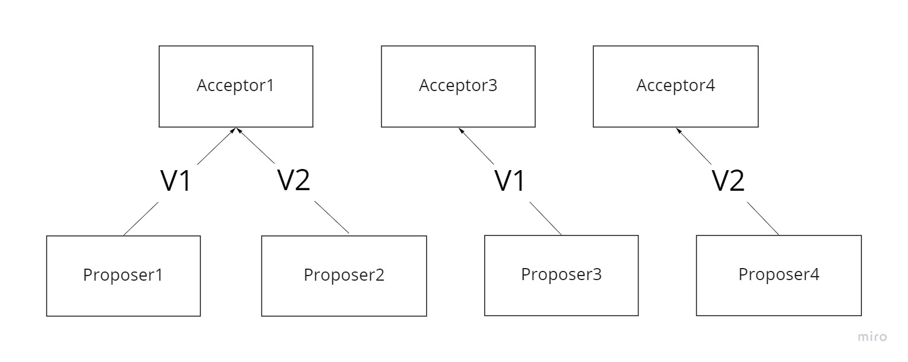
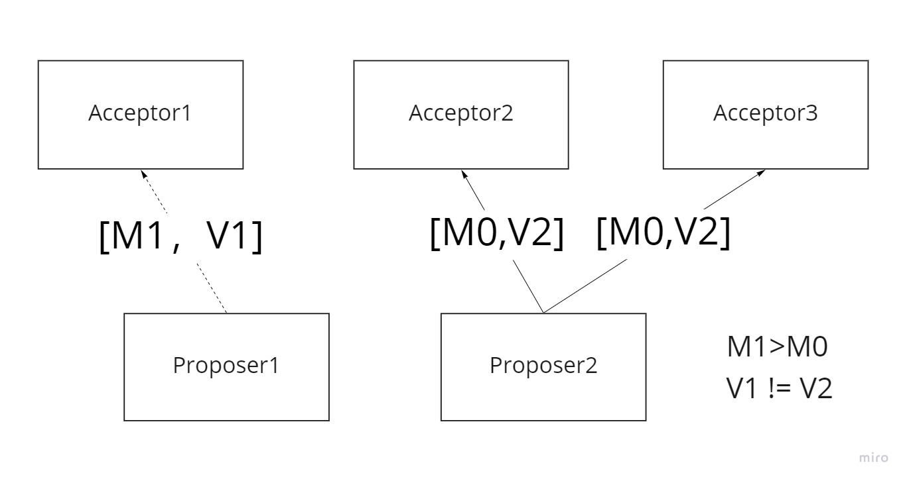

###### paxos 是什么？
paxos 是提高分布式系统容错性的一致性算法。

###### 对于一个一致性算法，需要保证以下几点:  
1. 在这些被提出的提案中，只有一个提案会被选中  
2. 如果没有提案被提出，那么就不会有被选中的提案  
3. 当一个提案被选定后，进程应该可以获取被选定的提案信息  

###### 对于一致性算法，安全性需求如下:
* 只有被提出的提案才能被选定
* 只能有一个值被选定
* 一个进程永远不会知道一个值已经被选定，除非它真的被选定

###### 提案的选定
选定一个提案最简单的方法是只有一个 Acceptor，它会将由 Proposer 发送给他的第一个提案作为选定的提案。不过这种方式存在单点故障。

为了避免单点故障，可以使用多个 Acceptor。Proposer 发送提案给 Acceptor 集合，集合中的每一个 Acceptor 都有可能选定提案，也有可能不选定提案。
当集合中大多数的 Acceptor 批准同一个提案时，我们就认为该提案被选定了。

为了保证只会有一个提案被选定，有如下要求：  
**1. 大多数指的是至少要有超过一半的 Acceptor 接受同一个提案**

如下图所示，如果只有一半的 Acceptor 批准了提案 V1，另外一半 Acceptor 批准了提案 V2。那么就无法选定一个提案出来。

**2. 每一个 Acceptor 最多只能批准一个提案**

如下图所示：如果 Acceptor1 能够批准 V1 和 V2 两个提案的话，并且 Acceptor3 批准 V1 提案， Acceptor4 批准 V2 提案。那么提案 V1 被 2 个
Acceptor 接受，提案 V2 被 2 个 Acceptor 接受，无法保证一个提案是由大多数 Acceptor 批准的。

   

###### 推导过程
在没有失败和消息丢失的情况下，我们想要在即使只有一个提案被提出的情况下，仍然也可以选定一个提案。这就表明有如下要求：
>P1：一个 Acceptor 必须批准它收到的第一个提案。   

如果不能满足上述要求，那么就有可能所有的 Acceptor 都没有批准提案。如下图所示。那么无法保证只有一个提案被选定。（无法选定一个提案，因为没有一个提案被批准）
   

不过 P1 引发了另外一个问题。如果每一个 Acceptor 都批准了它收到的第一个提案，不同的 Acceptor 批准了不同的提案，如下图所示。那么没有一个提案是由大多数批准的，
也就无法选定最终的提案了。

`P1（一个 Acceptor 必须批准它收到的第一个提案）`和`一个提案被选定需要由半数以上的 Acceptor 批准`意味着：  
**一个 Acceptor 能够批准多个提案**。否则就会出现上图的问题。

既然一个 Acceptor 能够批准多个提案，那么如果一个 Acceptor 批准了多个 value 值不同的提案，这样的话与逻辑不符合。因为一个 Acceptor 只可能会批准一个
value 值，他不可能既同意这个 value 值又同意那个 value 值。 因此我们可以明确：  
**一个 Acceptor 能够批准多个提案，但是这些提案的 value 值必须相同**

在这里我们使用一个全局唯一的编号来标识每一个被 Acceptor 批准的提案，当一个具有某 value 值的提案被半数以上的 Acceptor 批准后，我们就认为该
value 值被选定了，该提案也被选定了。需要注意的是此时一个提案是由一个全局唯一的标号和 value 两部分构成，即以`[编号，value]`表示一个提案。

我们可以允许多个提案被选定，但同时必须保证所有被选定的提案都具有相同的 value 值。这就表明有如下要求：
>P2：如果提案 [M0，V0] 被选定了，那么所有比编号 M0 更高的，且被选定的提案，其 value 值必须也是 V0。 （否则就不能满足“在这些被提出的提案中，只有一个提案会被选中”）

因为提案的编号是全序的，条件 P2 就保证了只有一个 value 值被选定这一关键安全性属性。同时一个提案要被选定，至少需要被一个 Acceptor 批准。因此，
可以通过满足以下条件来满足 P2：  
>P2a：如果提案 [M0，V0] 被选定了，那么所有比编号 M0 更高的，且被 Acceptor 批准的提案，其 value 值也必须是 V0。

至此，我们仍然需要 P1 来保证提案会被选定。但是通信是异步的，一个提案可能会在某个 Acceptor 还没收到的情况下就被其它的大多数 Acceptor 所选定了。
如下图所示：在 Acceptor1 还未收到提案的情况下，其它两个 Acceptor 已经批准了来自 Proposer2 的提案 [M0，V2]。而此时，Proposer1 产生了一个具有其它
value 值的，编号更高的提案[M1，V1]，并发送给了 Acceptor1。根据 P1 就需要 Acceptor1 批准该提案，但是这与 P2a 矛盾。

因此如果要同时满足 P1 和 P2a 就需要对 P2a 进行如下强化：
>P2b：如果一个提案 [M0，V0] 被选定后，那么之后任何 Proposer 产生的编号更高的提案，其 value 值都为 V0。

因为一个提案必须被 Proposer 提出后才能被 Acceptor 批准，因此 P2b 包含 P2a，进而包含 P2。于是，接下来的重点就是论证 P2b 成立即可：
>假设某个提案 [M0，V0] 已经被选定了，证明任何编号 Mn > M0 的提案，其 value 值都是 V0。 

###### 数学归纳法证明
我们可以通过对 M0 进行第二数学归纳法来进行证明，也就是说需要得出以下结论：  
假设编号在 M0 到 M（n-1）之间的提案，其 value 值都是 V0，证明编号为 Mn 的提案的 value 值也是 V0。

因为编号为 M0 的提案已经被选定了，这意味着肯定存在一个由半数以上的 Acceptor 组成的集合 C，C 中的每个 Acceptor 都批准了该提案。再结合归纳假设，
“编号为 M0 的提案被选定”意味着：  
C 中的每个 Acceptor 都批准了一个编号在 M0 到 M（n-1）范围的提案，并且每个编号在 M0 到 M（n-1）范围内的被 Acceptor 批准的提案，其 value 
值都为 V0。

因为任何包含半数以上的 Acceptor 集合 S 都至少包含 C 中的一个成员，因此我们可以认为如果保持了下面 P2C 的不变性，那么编号为 Mn 的提案的 value 
也为 V0。

>P2C：对于任意的 Mn 和 Vn ，如果提案 [Mn，Vn] 被提出，那么肯定存在一个由半数以上的 Acceptor 组成的集合 S，满足以下两个条件中的任意一个：
> * S 中不存在任何批准过编号小于 Mn 的提案的 Acceptor
> * 选取 S 中所有 Acceptor 批准的编号小于 Mn 的提案，其中编号最大的那个提案其 value 值是 V0

>也就是说对于 P2C，存在一个由半数以上的 Acceptor 组成的集合 S：
> * 要么集合 S 中没有一个 Acceptor 批准过编号小于 Mn 的提案
> * 要么集合 S 中所有的 Acceptor 批准过的编号小于 Mn 的提案中，编号最大的那个提案其 value 值为 V0。

###### paxos 算法选定提案过程
阶段一：  
1. Proposer 选择一个提案编号 Mn， 然后向 Acceptor 的某个超过半数的子集成员发送编号为 Mn 的 prepare 请求。
2. 如果一个 Acceptor 收到一个编号为 Mn 的 prepare 请求，且编号 Mn 大于该 Acceptor 已经响应的所有 prepare 请求的编号，那么它就会将它已经
   批准过的最大编号的提案作为响应反馈给 Proposer，同时该 Acceptor 会承诺不会再批准任何编号小于 Mn 的提案。

阶段二：
1. 如果 Proposer 收到了来自半数以上的 Acceptor 对其发出的编号为 Mn 的 prepare 请求的响应，那么它会发送一个针对 [Mn，Vn] 提案的 Acceptor 
   请求给 Acceptor。注意：Vn 的值就是收到的响应编号最大的的提案的值，如果响应中不包含任何提案，那么它就是任意值。
2. 如果 Acceptor 收到这个针对 [Mn，Vn] 提案的 Acceptor 请求，只要该 Acceptor 尚未对编号大于 Mn 的 Proposer 请求做出响应，它就可以通过这个提案。

###### paxos learner 获取提案
Acceptor 可以将批准的提案发送给一个特定的 learner 集合，集合中每一个 learner 都可以在一个提案被选定后通知其它所有的 learner。learner
集合数量越大，可靠性越好。

