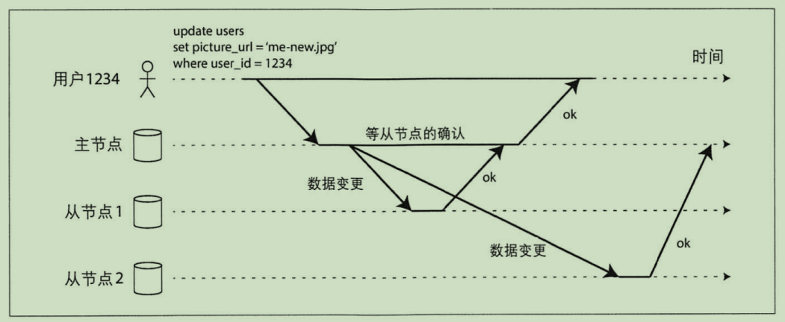

## 主节点与从节点

主从复制的原理如下：
1. 指定一个副本为主副本（主节点），当客户写数据库时，必须将写请求首先发送给主副本，主副本首先将新数据写入本地存储
2. 其它副本全部成为从副本（从节点），主副本把新数据写入本地存储后，然后将数据变更作为复制的日志或更改流发送给所有从副本。每个从副本获得更改日志之后
   将其应用到本地，并严格保持与祝福本相同的写入顺序。
3. 客户端从数据库读取数据时，可以在主副本或从副本上执行查询。但是只有主副本能够接收写请求；从客户端的角度看，从副本都是只读的。

主从复制不仅限于数据库，还广泛应用于分布式消息队列如`Kafka`和`RabbitMQ`。

## 同步复制与异步复制

#### 同步复制
上图中，从节点 1 的复制是同步的。主节点收到客户端的写请求后将数据复制到从节点 1。主节点必须等待从节点 1 确认完成写入才能向客户端报告完成数据写入。

同步复制的优点是：
1. 一旦主节点向客户端确认，从节点可以保证完成了与主节点的数据同步且数据是最新的。
2. 当主节点发生故障时，总是可以在从节点继续访问最新数据。

同步复制的缺点是：
1. 如果同步的从节点无法完成确认，写入就不能视为成功。那么主节点会阻塞其后所有的写操作，直到同步副本确认完成。（任何一个同步节点的中断都会导致
   整个系统的停滞不前）

#### 异步复制
上图中，从节点 2 的复制是异步的。主节点收到客户端的写请求后将数据异步复制到从节点 2，不需要等待从节点 2 确认完成就立即向客户端报告完成数据写入。

异步复制的特点：
1. 若主节点挂掉，则所有尚未复制到从节点的请求都会丢失。这意味着即使主节点向客户端确认了写操作，但是无法保证数据的持久化。
2. 无论从节点滞后主节点有多少，主节点都能够继续相应写请求，系统的吞吐行更好。

#### 半同步复制
实际中，如果数据库启动了同步复制，通常意味着其中一个节点是同步的，而其它节点是异步的。万一同步的节点变得不可用或者性能下降，则将另一个异步节点提升
为同步节点。这样可以保证集群中至少有 2 个节点（主节点和从节点）含有最新的数据副本。

## 配置新的从节点
场景：当需要增加副本数以提高容错能力，或者替换失败的副本时，就需要考虑增加新的从节点。

因为客户端始终在不断的向数据库写入数据，因此我们需要在不停机，数据服务不中断的前提下来配置新的从节点。逻辑上步骤如下：
1. 在某个时间点对主节点的数据副本生成一个一致性快照，这样可以避免长时间锁定整个数据库
2. 将此快照拷贝到新的从节点
3. 从节点加入到集群中连接主节点并请求快照之后所发生的数据变更日志。因为在第一步创建快照时，快照和系统复制日志的某个确定位置相关，这个位置信息在
   不同的系统有不同的称呼。如`MySQL`将其称为`binlog coordinates`
4. 获得日志后，从节点来应用快照之后所有数据变更，这个过程称为`追赶`。接下来，它可以继续处理主节点上新的数据变化。

## 处理节点失效
系统中任何节点都有可能因故障或计划内维护而导致中断甚至停机。主从复制技术有`从节点失效：追赶式恢复`和`主节点失效：节点切换` 2 种方式来处理节点失效，
实现高可用。

#### 从节点失效：追赶式恢复
从节点的本地磁盘上保存了副本收到的数据变更日志。如果从节点发生崩溃，然后顺利重启。那么根据副本的复制日志，从节点可以知道自己崩溃前所处理的最后一笔
事务，然后连接到主节点，并请求那笔事务之后的所有数据变更日志并将其应用到本地来追赶主节点。之后就和正常情况一样持续接收来自主节点的数据变化。

#### 主节点失效：节点切换
处理主节点故障的情况比较棘手：选择某个从节点将其提升为主节点；客户端也需要更新，这样之后的写请求会发送给新的主节点，然后其它从节点要接收来自新的主
节点上的变更数据。这一过程称之为`切换`。

故障切换可以手动进行，也可以自动进行。自动切换的步骤通常如下：
1. 确认主节点失效。大多数系统采用超时机制来确认主节点失效，节点间频繁的相互发送心跳包，如果发现某节点长时间没有响应心跳，则认为该节点失效了。
2. 选举新的主节点。通过选举的方式来选举出新的主节点，或者由控制节点来指定新的主节点。候选节点最好与主节点的数据差异最小，这样可以最小化数据丢失的风险。
3. 重新配置系统使新的主节点生效。客户端现在需要将写请求发送给新的主节点。如果原主节点之后重新上线，可能仍然认为自己是主节点，而没有意识到其它节点已
   达成共识使其下台。这时系统要确保原主节点降级为从节点

上述的`主节点失效-重新选举主节点`也有很多问题：
* 如果使用了异步复制，当主节点失效时从节点没有同步到主节点的最新数据，此时从节点通过选举成为新的主节点。原主节点恢复后加入到集群中，向新主节点发送
  写请求，并且新主节点也会接收客户端的写请求。此时新主节点就可能会收到冲突的写请求，这是因为原主节点没有发现自己角色的变化，还在试图同步其它从节点，
  但是曾经的一个从节点已经提升为主节点了。
  
  常见的解决方案是，原主节点丢弃掉未完成同步的写请求。但是这会造成数据复制无法持久化。
* 如果数据库和其它的系统或数据库协同工作，上述的丢弃数据方案就十分危险。比如说数据库使用自增主键，且主键被 redis 所引用表明用户的个人信息。
  当主节点失效，未完全同步的从节点提升为主节点，此时新的主节点是落后于原来的主节点的，且落后的数据都已被 redis 所引用。当新的主节点接收
  客户端请求使用已被分配主键时，而这些主键恰好被`redis`所引用，结果会出现数据库和`redis`引用数据不一致，引用错误等问题。
* 在某些故障的情况下，可能会出现 2 个节点都认为自己是主节点。这种情况被称为脑裂。
* 如何选择合适的超时时间来检测主节点失效也很重要。如果设置的时间太长，不能实时检测到主节点失效；如果设置的时间太短，可能只是网络波动或系统负载过大，
  那么频繁地触发选举只会加大系统负载。

## 复制日志的实现
主从复制技术有多种不同的实现方式。

#### 基于语句的复制
主节点记录下所执行的每一个操作，如 `insert`,`update`等。并将这些语句转发给从节点来实现复制。
这种复制方式有很多的缺点，如：
1. 任何调用非确定性函数的语句。如`now()`,`rand()`等。
2. 若语句依赖现有的数据，那么所有副本必须按照完全相同的顺序来执行语句，否则同一条语句可能会带来不同的结果。
3. 有副作用的语句（触发器，存储过程，用户自定义函数等），可能会在每个副本产生不通的副作用

#### 基于预写日志（WAL）传输
不论数据库以哪种方式存储数据，所有对数据库的写入都需要先记录到日志中，因此可以使用一份完全相同的日志在另一个节点上构建副本。这种方式的缺点是
日志描述的数据十分底层，使得日志的复制方案和存储引擎紧密耦合在一起了。

#### 基于行的逻辑日志复制
采用和存储引擎不同的日志格式来进行复制，这种复制方式使得复制的数据结构和存储引擎的日志存储逻辑解耦合。也称为逻辑日志。

关系型数据库的逻辑日志通常指的是对数据表的行的修改变化：
* insert: 日志包含所有的最新值
* delete：日志包含主键
* update: 日志包含主键和要更新的字段名称和值

#### 基于触发器的复制
使用触发器注册应用层代码，实现自定义的复制逻辑。相比其它的复制方式开销更高，更容易出错但是更加灵活。

