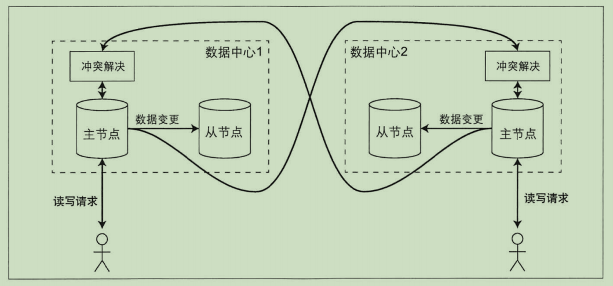
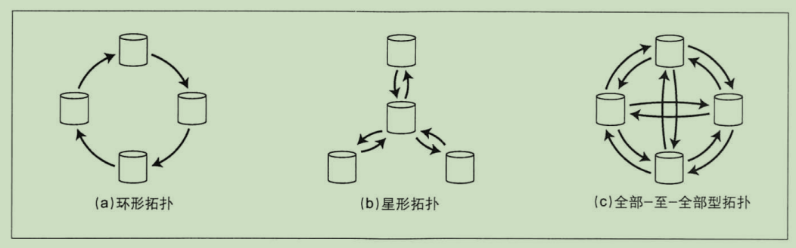

## 多主节点复制
集群中的副本全部都是主节点，每个主节点都可以接收写请求，并将数据变更转发给其它的主节点。

## 适用场景
在一个数据中心内部使用多主节点没有意义，因为复杂性远远超过其所能带来的好处。但是在以下场景下这种配置是合理的。

#### 多数据中心
为了容忍数据中心级别的故障或者让服务器更接近用户，可以将副本存放到不同的数据中心里面。对于主从复制来说，主节点必须放在其中某一个数据
中心里面，所有的写请求必须经过该数据中心。

有了多主复制模型，则可以在每个数据中心都配置一个主节点。在每个数据中心内部，使用主从复制模型。在数据中心之间，由各个数据中心
的主节点负责与其它数据中心的主节点进行数据交换。

多数据中心的环境下，单主节点的主从复制方案和多主节点的复制方案之间的区别：  
**性能**：
对于主从复制模型，所有的写请求都必须经过广域网发送到主节点所在的数据中心。这会大大增加写入延迟并且偏离了多数据中心的初衷（就近原则）
对于多主节点模型，每个写操作都会发送到距离客户端最近的数据中心的主节点上，然后使用异步复制的方式同步到其它数据中心的主节点，最后在
数据中心内部由主机点复制给其它的从节点。  
因此，多主节点模型有效降低了网络延迟，性能更好。

**容忍数据中心失效**：
对于主从复制模型，如果主节点所在的数据中心发生故障，那么必须切换到其它的数据中心，将其中的一个从节点提升为主节点。
对于多主节点模型，每个数据中心能够独立于其它数据中心运行。

尽管多主复制有上述的优点，但是也有一个很大的缺点：不同的数据中心可能会修改同一份数据，如何解决写冲突并不是一件容易的事情。

#### 离线客户端操作
另一种多主复制比较适合的场景是，应用离线后还需要继续使用。  
比如用户在手机，ipad，电脑上修改同一份 excel。在离线状态下的任何修改会在设备下次上线时与服务器以及其它设备进行同步。在这种情况下每一个设备
就相当于是一个主节点，设备之间采用异步的方式进行复制。

## 处理写冲突
多主复制最大的问题是可能会发生写冲突，如 2 个主节点同时修改同一数据。

#### 同步与异步冲突检测
多主节点模型无法同步检测写冲突（只能异步检测写冲突）。原因如下：
同时有 2 个写请求修改同一个数据，这 2 个写请求分别到达不同的主节点中，并且它们都成功写入。只有在稍后的时间点主节点之间异步同步数据时才会检测到冲突。
如果一定要同步检测写冲突的话，就需要等待写请求完成对所有副本的同步再返回响应给客户端。这样就会失去多主节点的优势，使得系统性能大大降低。

#### 避免冲突
处理冲突最理想的策略是避免发生冲突。如果应用层可以保证对特定记录的写请求总是通过同一个主节点，那么就不会发生写冲突。
比如说用户需要更新自己的数据，那么就确保用户每次更新数据，请求都路由到同一个数据中心的主节点上。但是如果该数据中心发生故障或者用户漫游到另一个
位置因而更靠近新的数据中心，此时避免冲突的当时就不再有效。

#### 收敛于一致状态
所有的复制模型都应该保证数据在所有的副本中的最终状态一定是一致的，即不存在写冲突，当所有更改最终被复制，同步之后，所有副本的最终值是相同的。

实现收敛于一致状态有以下几种方式：
* 给每个写请求分配一个`id`，出现冲突时`id`值最高的请求获胜，并丢弃其它的写请求。这种方法很容易造成数据丢失。
* 为每个副本分配一个`id`，并制定规则。如：`id`值高的副本的写请求优先于`id`值低的副本的写请求
* 将发生冲突的数据合并在一起。如`B/C`
* 应用层记录冲突并解决

#### 自定义冲突解决逻辑
解决冲突最合适的方式可能还是需要应用层，所以大多数的多主节点复制模型都有相应的工具来让用户编写代码解决冲突。
**在写入时执行**
当数据库检测到冲突时就会调用应用层处理冲突的逻辑。
**在读取时执行**
当检测到冲突时，所有的冲突都会被记录下来。下一次读取数据时，会将数据的多个版本返回给应用层，当应用层解决完冲突后再将最后的结果写入数据库。

#### 什么是冲突
有些冲突显而易见，比如说 2 个写操作同时修改同一行数据的同一个字段。有些冲突产生的十分微妙，比如说 2 组人同时预定同一个会议室。

## 拓扑结构
复制的拓扑结构描述了写请求从一个节点传播到其他节点的通讯路径。

常见的拓扑结构：
* 环形拓扑：每个节点接收前序节点的写入，并将这些写入（和自己的写入）转发给后序节点
* 星型拓扑：一个指定的 root 节点将写入转发给所有其它节点
* All-To-All 拓扑：每一个节点都将写入转发给其它的所有节点

环形拓扑和星型拓扑的写请求需要通过多个节点才能够到达所有副本。为了防止无限循环，每个节点都有一个 id，当请求经过一个节点时会记录该节点的 id。
这样节点就不会重复的转发已处理过的请求了。另外如果其中某一个节点发生了故障，可能会影响其它节点的复制日志的转发。

All-To-All 虽然避免了节点的单点故障，但是也有自己的问题。比如某些网络链路要比其它的网络链路更快，这样可能会导致新的写请求被老的写请求所覆盖。
因为老的写请求网络链路的速度较慢，一个节点先收到的最新的写请求，之后再收到老的写请求。那么新的写请求就会被老的写请求所覆盖。

