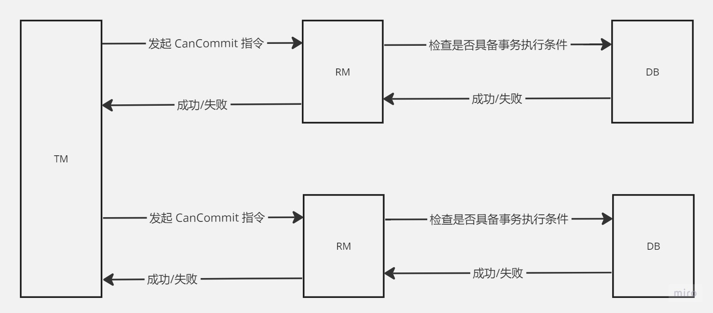

## XA 事务协议
为了解决分布式事务的一致性问题（多个节点一起提交事务或一起回滚事务），X/OPEN 组织提出了一套名为`X/OPEN XA`的事务处理架构。

XA 核心定义了以下模型：
* 全局的事务管理器（Transaction Manager）：事务协调者：负责分配事务唯一标识，监控事务的执行进度，并负责事务的提交、回滚等
* 局部资源管理器（Resource Manager）：事务参与者：参与执行事务的进程

事务的执行过程由 TM 统一来决策，其它 RM 只需要按照 TM 的指令来完成具体的事务操作即可。而 RM 在协商各个事务节点的过程中、什么情况下决定集体提交事务，
什么情况下又决定集体回滚事务，这里取决于 XA 事务模型里使用了哪种协商协议（2PC、3PC)。

## 2PC（两阶段提交）
2PC 协议的核心思路是协调者通过和参与者通过两个阶段的协商达到分布式事务一致性。第一阶段确认协调者是否具备执行事务的条件，第二阶段根据第一阶段各个协调者的响应
制定统一的事务策略。

#### 准备阶段
在准备阶段，协调者向各个参与者发送 prepare 指令，参与者收到指令后进行以下步骤：
1. 检查是否具备事务执行条件
2. 对事务相关数据进行加锁
3. 生成事务相关日志(redo log、undo log)
4. 执行本地事务，但不提交。等待第二阶段协调者的指令。

最后，参与者根据以上步骤的执行情况向协调者反馈成功或失败。

#### 提交阶段
当协调者收到所有参与者的响应信息后，会根据结果做出最终决策。

如果所有参与者都响应成功，那么协调者会记录全局事务信息然后向所有参与者发送 commit 指令。 参与者收到 commit 指令后会对上一阶段的事务数据进行提交。

当有任意参与者响应失败时，协调者会向所有的参与者发送 abort 指令。当参与者收到 abort 指令后，会进行事务回滚，清除上一阶段的 undo log，redo log。

#### 2PC 的异常场景处理机制
###### 参与者挂掉
* 如果在第一阶段，协调者发送 prepare 指令给所有的参与者后，参与者挂掉了。那么此时协调者会因为迟迟收不到参与者的消息而导致超时，
协调者在超时之后会统一发送 abort 指令进行事务回滚。

* 如果在第二阶段，协调者发送 commit 或者 abort 指令给所有参与者后，参与者挂掉了，那么协调者会在超时之后进行消息重发，
直到事务完成或人工介入。

###### 协调者挂掉
* 如果在第一阶段发送 prepare 指令后挂掉，此时参与者一直得不到协调者的下一步指令而一直陷入阻塞状态，资源也会一直被锁住。直到协调者恢复之后向参与者发送指令。

* 如果在第二阶段挂掉，那么此时协调者已经向所有者发出最后阶段的指令了，所以收到指令的参与者会完成最后的 commit 或 rollback 操作，
对于参与者来说事务已经结束，所以不存在阻塞和锁的问题，当协调者恢复后，会把事务日志状态标记为结束。

###### 网络分区造成消息丢失
* 第一阶段消息丢失， 协调者发送给参与者的消息丢失了。那么此时参与者因为收不到消息所以不会执行任何操作，也不会响应协调者消息。此时，协调者因为没有收到
参与者的响应而超时，所以协调者会决定回滚事务，向所有参与者发送 abort 指令。

* 第二阶段，无论是协调者发送给参与者的消息丢失还是参与者响应协调的消息丢失。都会导致协调者超时，此时协调者会进行重试，直到所有参与者响应成功。

###### 极端情况下数据不一致的风险
* 协调者在第二阶段向部分参与者发送了 commit 指令后挂了，那么此时收到了 commit 指令的参与者会进行事务提交，而未收到消息的参与者还是等着协调者的指令，
所以这个时候会产生数据的不一致，此时必须要等协调者恢复之后重新发送指令，参与者才能达到最终的一致状态。

* 第二阶段网络发生问题导致部分消息丢失，有些参与者收到了 commit 指令，有些参与者还没有收到 commit 指令，结果收到了指令的参与者提交了事务，
没收到消息的参与者还在等指令，它不知道该进行回滚还是提交，这个时候同样也会产生数据不一致的问题。

#### 2PC 遗留问题
1. 性能问题
从事务开始到事务最终提交或回滚，这期间参与者的资源一直处于锁定状态。所以 2PC 的性能不会太高
2. 数据不一致风险
从上面我们分析知道，极端情况下不管是由于协调者故障，还是网络分区都会有导致数据不一致的风险
3. 协调者故障导致的事务阻塞问题
协调者出现故障后，所有参与者都会阻塞直到协调者恢复

## 3PC（三阶段提交）
3PC 是 2PC 的升级版，为了解决 2PC 遗留问题而诞生。引入了两个新的特性：
1. 协调者和参与者均引入超时机制，通过超时机制来解决 2PC 的同步阻塞问题，避免事务资源被永久锁定
2. 把二阶段演变为三阶段，二阶段提交协议中的第一阶段"准备阶段"一分为二，形成了新的 CanCommit、PreCommit、DoCommit 三个阶段组成事务处理协议

###### 询问阶段
询问阶段的目的是核实所有的参与者是否具备事务执行条件（检查连接，锁等信息）。参与者收到 CanCommit 指令后判断是否具备事务执行条件，
然后向协调者响应成功或失败。

如果协调者收到任何一个参与者失败响应，那么此时会协调者会记录全局事务信息（事务信息、状态为 abort），然后向所有参与者发送 abort 指令。
只有当所有参与者都响应成功之后才会进入第二阶段，协调者首先会记录全局事务信息（事务信息、状态为 PreCommit），然后向所有参与者发送 PreCommit 指令。

###### 准备阶段
在准备阶段，协调者向各个参与者发送 PreCommit 指令，参与者收到指令后进行以下步骤：
1. 对事务相关数据进行加锁
2. 生成事务相关日志(redo log、undo log)
3. 执行本地事务，但不提交。等待第三阶段协调者的指令。

最后，参与者根据以上步骤的执行情况向协调者反馈成功或失败。

当协调者收到任何一个参与者响应失败，此时协调者会记录全局事务信息（事务信息、状态为abort），然后向所有参与者发送 abort 指令。
只有当所有参与者都响应成功之后，此时进入第三阶段，协调者首先会记录全局事务信息（事务信息、状态为 commit），然后向所有参与者发送 DoCommit 指令。

这里与 2PC 不同的是，在进入准备阶段后，如果参与者迟迟没有收到协调者的消息（网络分区或协调者故障），那么此时参与者会有超时机制，
**当参与者超时之后会执行统一默认策略进行事务 Commit** 。 

###### 提交阶段
**如果在准备阶段任意一个参与者响应失败或者协调者超时，协调者会决定进行事务回滚**，首先记录全局事务日志状态为回滚，然后向所有参与者发送 abort 指令，
参与者收到 abort 指令会回滚本地事务，清除本地事务日志，然后响应协调者。

如果所有参与者都响应成功，那么协调者会决定提交事务，首先会记录全局事务信息状态为 commit，然后向所有参与者发送 commit 指令，
参与者收到 commit 指令后会对上一阶段生成的事务信息进行最后的 commit。

###### 3PC 与 2PC 对比
1. 性能问题（相比2PC性能更差）
2PC 需要锁定资源，并且时间取决于最慢的一个参与者。3PC 同样也需要锁定资源，同样也是必须要等待所有参与者响应才能进行下一步流程。
并且 3PC 增加了询问阶段，这就使得 3PC 通信成本更高，性能反而会更差。
2. 协调者故障导致的事务阻塞问题（解决）
因为 3PC 增加了询问阶段，然后在准备阶段增加了参与者超时机制，所以协调者故障并不会一直阻塞着事务进行，参与者超时之后会进行事务 commit。
3. 数据不一致的风险（还是存在）
如果协调者第二阶段的决策是 abort，此时协调者把 abort 指令发送给部分参与者之后挂掉了，那么收到了 abort 指令的参与者进行了数据回滚，
但是没有收到 abort 指令的参与者会根据超时机制进行事务 commit，最终就会有部分参与者 rollback，部分参与者进行了 commit，最后数据不一致。

## 不可能完美（CAP）
强一致的事务一致性在单机事务中可以完美实现，但是在分布式场景中很难达到预期结果。因为在分布式环境中不仅需要考虑数据一致性，还需要考虑多节点的可用性和
网络分区容错性等多个问题。

#### CAP 定义
CAP 理论主要描述了在一个分布式系统中，它的一致性、可用性、分区容错性同时只能满足两个，必然会牺牲一个。
* 一致性（C）：all nodes see the same data at the same time(所有节点在同一时间的数据是相同的)
* 可用性（A）：可用性是指系统提供的服务必须一直处于可用的状态，对于用户的每一个操作请求总是能够在有限的时间内返回结果
* 分区容错性（P）：分布式系统在遇到任何网络分区故障的时候，仍然需要能够保证对外提供满足一致性和可用性的服务，除非是整个网络环境都发生了故障

因为网络环境的不可靠，分布式环境中节点也必须通过网络才能建立通讯，所以分布式环境中是无法避免网络分区问题的，如果因为发生了网络分区系统就无法使用，那么分布式系统就没有存在价值了。
所以在分布式环境中必须要满足分区容错性，那么在发生网络分区的时候系统只能在**一致性和可用性之间权衡**。

## 接受不完美（BASE）
BASE 理论是对 CAP 理论的延伸，核心思想是即使无法做到强一致性（Strong Consistency，CAP 的一致性就是强一致性），但应用可以采用适合的方式达到最终一致性
（Eventual Consitency）。 BASE 是 Basically Available（基本可用）、Soft state（软状态）和Eventually consistent（最终一致性）三个短语的缩写。
* 基本可用（Basically Available）：
指分布式系统在出现不可预知故障的时候，允许损失部分可用性。
* 软状态（ Soft State）：
指允许系统中的数据存在中间状态，并认为该中间状态的存在不会影响系统的整体可用性。
* 最终一致（ Eventual Consistency）：
强调的是所有的数据更新操作，在经过一段时间的同步之后，最终都能够达到一个一致的状态。因此，最终一致性的本质是需要系统保证最终数据能够达到一致，而不需要实时保证系统数据的强一致性。

> 在 CAP 终结了在强一致事务上继续探索的路后，基于 Base 理论倡导的弱一致性的分布式事务实现方案逐渐兴起，比如有基于消息实现事务、TCC、SAGA 、AT 等模式实现分布式事务最终一致性的解决方案。