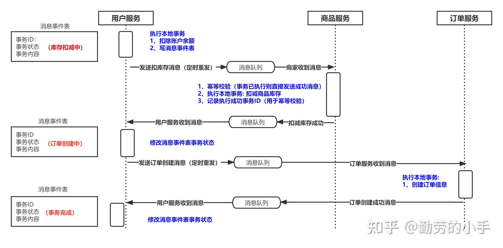
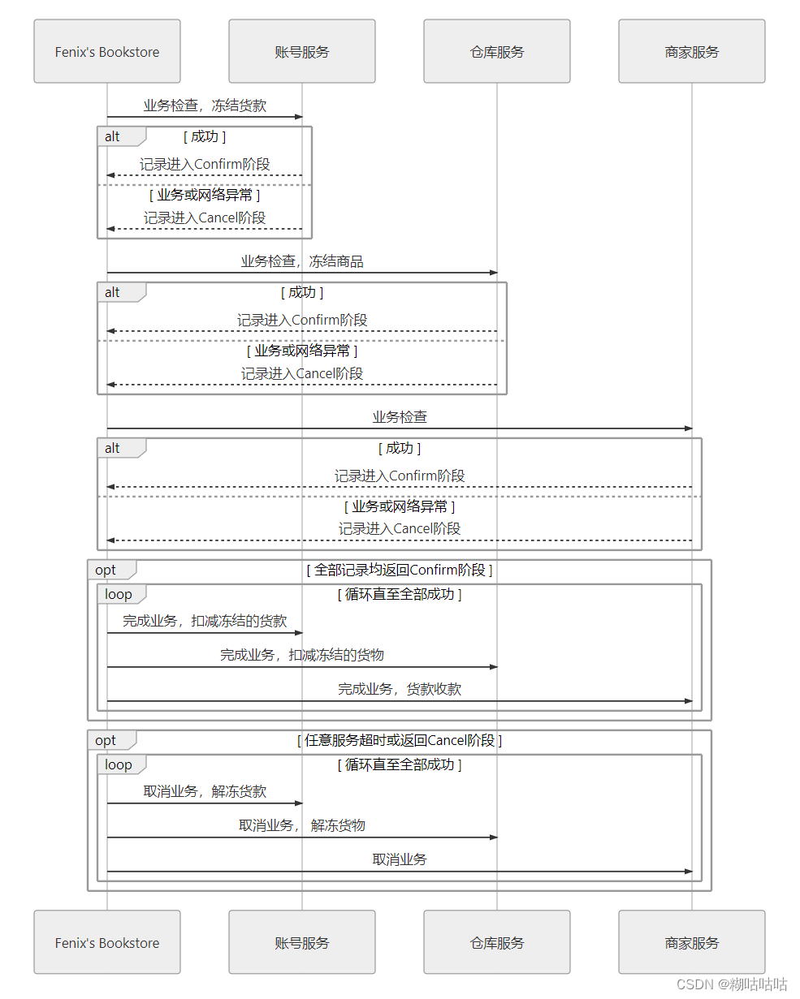

## 基于消息模式的最终一致性方案
基于消息模式的最终一致性方案模型中，事务发起方在完成本地事务后会向下一个事务参与者发送一个消息，收到消息的事务参与者会执行本地事务。执行完成后
会向事务发起方返回成功消息。事务发起方收到成功消息后，会继续向下一个事务参与者发送消息。以此类推，直到达成数据一致性。

以用户购买商品为例，用户购买商品会涉及以下 3 个事务：
1. 用户服务扣除余额
2. 商品服务减少库存
3. 订单服务生成订单

###### 第一阶段：
1. 用户服务执行本地事务扣除余额
2. 写消息事件表记录事务状态为库存扣减中
3. 发送消息给商品服务进行扣减库存
4. 定时轮询消息事件表，如果事务状态为库存扣减中。那么重复给商品服务发送扣减库存消息。如果事务状态为订单生成中。那么重复给订单服务发送生成订单消息

###### 第二阶段：
1. 商品服务对收到的消息进行幂等性校验，如果已经该事务 ID 已经处理过，那么直接返回成功消息
2. 执行本地事务，扣减库存
3. 记录下已执行成功的事务 ID，用于幂等性校验
4. 返回成功消息

###### 第三阶段：
1. 商品服务收到库存扣减成功消息，写消息事件表记录事务状态为订单生成中
2. 向订单服务发送生成订单消息

###### 第四阶段：
1. 订单服务对收到的消息进行幂等性校验，如果已经该事务 ID 已经处理过，那么直接返回成功消息
2. 执行本地事务，生成订单
3. 记录下已执行成功的事务 ID，用于幂等性校验
4. 返回成功消息

###### 第五阶段：
1. 收到订单生成成功消息
2. 写消息事件表记录事务状态为事务已完成
3. 事务结束

#### 消息模式的优点
1. 性能高：事务之间没有阻塞，纯异步执行
2. 实现简单：设计和实现上相对简单，不需要过多考虑失败的情况

#### 消息模式的缺点
1. 不支持回滚，只需成功不许失败。如果失败了，会进行重试，直到成功为止
2. 不具备隔离性。两个操作相同资源的事务可以同时进行
3. 有业务侵入性

#### 消息模式的适用场景
1. 业务简单
2. 对事务实时性要求不高（异步和定时任务即时性不高）
3. 业务可以进行补偿（2个事务买仅剩的同一本书，库存为负数时可以调度补充）
4. 业务即使失败影响也不大

## TCC 模式
TCC 是一种业务侵入性较强的事务方案。要求业务处理过程分为`预留业务资源`和`确认/释放消费资源`两个子过程。如 TCC 的名称所示，它分为 3 个阶段：
1. Try: 尝试执行阶段。完成所有业务的可执行性检查（保证一致性），并且预留好所需的资源即加锁（保证隔离性）
2. Confirm: 确认阶段。不进行任务业务检查，直接使用 Try 阶段预留的资源来提交事务。Confirm 阶段可能会重试，因此需要具备幂等性
3. Cancel: 取消阶段。释放 Try 预留的资源。Cancel 阶段可能会重试，因此需要具备幂等性

#### TCC 实现示例
以用户购买商品为例，用户购买商品会涉及以下 3 个事务：
1. 用户服务扣除余额
2. 商品服务减少库存
3. 订单服务生成订单

###### Try 阶段：业务检查，预留业务资源。
1. 通知用户服务，业务检查冻结余额
2. 通知商品服务，业务检查冻结商品
3. 通知订单服务，订单服务不存在资源竞争，不需要做资源预留操作

###### Confirm 阶段：使用 Try 阶段的预留资源执行事务操作
1. 若 Try 阶段所有服务都返回成功消息，那么进入 Confirm 阶段
2. 使用 Try 阶段的预留资源执行事务操作。用户服务完成业务，扣减余额；商品服务完成业务，扣减商品；订单服务完成业务，生成订单

> 备注: Confirm 阶段会重复执行，直到所有服务成功执行完事务操作

###### Cancel 阶段：释放 Try 阶段的预留资源
1. 当 Try 阶段任意一个服务返回失败或超时，那么进入 Cancel 阶段
2. 调用各个服务的 Cancel 接口进行资源释放。用户服务还原冻结的余额；商品服务还原冻结的商品

> 备注: Cancel 阶段会重复执行，直到所有服务都释放资源

#### TCC 模式的优点
1. 没有全局锁，本地事务锁在本地操作完成后马上会释放，不会像 2PC、3PC 一样整个事务执行的过程都会锁住资源，所以 TCC 性能非常高
2. 具备隔离性: 通过隔离资源达到事务隔离的目的，先预留资源，再真正使用资源，避免了出现两个事务并发时可能导致的同一个资源被使用多次的问题，适合资源敏感的场景
3. 允许事务失败：可以进行事务回滚

#### TCC 模式的缺点
1. 有业务侵入性。比如无法控制银行的第三方系统来锁定余额

#### TCC 模式的适用场景
1. 有资源隔离性要求、并且对业务系统有控制权，有修改结构的权限

## SAGA 模式
SAGA 模式将分布式系统中的大事务分解成一系列的本地事务。SAGA 有两部分组成：
* 将整个分布式的事务 T 分解为 n 个子任务，命名为 T1，T2，T3...。每个子任务都能视为原子行为。如果分布式事务能够正常提交，其对数据一致性的影响与
T1，T2，T3...顺序执行等价
* 每一个子任务 Tn 都有对应的补偿动作 Cn。比如 Tn 是余额加 100，那么 Cn 就是余额减 100

#### SAGA 正向恢复
正向恢复模式不提供补偿机制，如果某一个阶段失败了则采取重试机制，直到最执行成功。

#### SAGA 反向恢复
如果事务 Tn 执行失败，则一直执行 Tn 的补偿动作 Cn，直到成功为止。

#### SAGA 优点
1. 允许事务失败：可以进行事务补偿
2. 对资源控制没要求（相对于TCC）
3. 比较简单(相对于TCC)，可以灵活的拆分事务粒度，针对细粒度的接口制定对应的补偿方案即可，容易理解和实现，适合用于长事务的解决方案

#### SAGA 缺点
1. 不具备隔离性，不能保证，不同SAGA事务之间中间结果可见
2. 有业务侵入性：需要对根据对应接口制定补偿策略

#### SAGA 模式的适用场景
1. 有第三方系统参与对资源没有控制权，无法实现TCC模式的场景
2. 遗留系统服务长事务场景
3. 对隔离性没要求而又需要补偿机制的场景

## AT 模式
分布式开源框架 Seata 中提出了一种 AT 模式分布式事务解决方案。它基于 2 阶段提交，但是对于 XA 2PC 的却笑，即需要所有参与者都返回成功后协调者才能
发送 commit 指令而导致的木桶效应。AT 设计了针对性的解决方案：

#### 一阶段
1. 执行本地事务（还没有提交）
2. 保存执行事务之前数据的镜像和执行事务之后的镜像
3. 生成回滚日志，把前后镜像数据以及业务 SQL 相关的信息组成一条回滚日志记录，插入到 UNDO_LOG 表中
4. 提交前，向 TC 注册分支，申请全局锁
5. 本地事务提交：业务数据的更新和前面步骤中生成的 UNDO LOG 一并提交
6. 将本地事务提交的结果上报给 TC

#### 二阶段-提交
1. 收到 TC 的分支提交请求，把请求放入一个异步任务的队列中，马上返回提交成功的结果给 TC
2. 异步任务阶段的分支提交请求将异步和批量地删除相应 UNDO LOG 记录

#### 二阶段-回滚
1. 收到 TC 的分支回滚请求，开启一个本地事务
2. 通过 XID 和 Branch ID 查找到相应的 UNDO LOG 记录
3. 数据校验：拿 UNDO LOG 中的后镜与当前数据进行比较，如果有不同，说明数据被当前全局事务之外的动作做了修改。这种情况，需要根据配置策略来做处理
4. 根据 UNDO LOG 中的前镜像和业务 SQL 的相关信息生成并执行回滚的语句
5. 提交本地事务。并把本地事务的执行结果（即分支事务回滚的结果）上报给 TC

#### AT 模式优点
1. 无业务侵入性：集成 Seta 框架后，使用只需一个注解即可
2. 性能高：不对数据库加锁，本地事务执行完马上释放
3. 具备隔离性：使用全局锁则可保证事务隔离性，但全局锁对性能有影响

#### AT 模式缺点
1. 目前 AT 模式是一个理想的分布式事务解决方案，但是它受限于支持的数据库。比如有的数据库 Seta 并不支持
2. 补偿模式的局限：基于补偿模式有些场景是不合适，特别是金融转账对资源非常敏感的，这种场景采用TCC模式更合适。